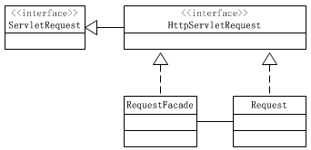

# 设计模式

原理部分

https://www.code-nav.cn/course/1789189862986850306/section/1789190431398928386?type=#heading-82

## 概述

代码设计经验总结，描述常见问题以及解决方案。能够使得程序设计更加标准化，提高代码重用性

事实上，工作中很少主动使用设计模式，框架已经提供了成熟的设计模式

阿里巴巴JAVA规范

> 11. 【推荐】如果使用到了设计模式，建议在类名中体现出具体模式。 
>
>  说明：将设计模式体现在名字中，有利于阅读者快速理解架构设计思想。 
>
>  正例：public class OrderFactory;
>
>   public class LoginProxy;
>
>   public class ResourceObserver; 

# 软件设计原则

可维护性、可复用性、、可拓展性和灵活性

## 开闭原则OCP

对拓展开放，对修改关闭。拓展时不用修改代码，实现热插拔

使用接口和抽象类，当软件需求发生变化时，只需根据需求重新派生一个实现类。**当需求改变时，只用更改客户端代码**，而无需更改之前类中的代码。

## 里氏替换原则LSP

子类可以拓展父类的功能，但尽量不要重写父类的方法（只实现抽象方法）

## 依赖倒转原则DIP

- 高层模块不应该依赖低层模块，二者都应该依赖其抽象
- 抽象不应该依赖细节，细节应该依赖抽象
- 依赖倒转(倒置)的中心思想是面向接口编程
- 依赖倒转原则是基于这样的设计理念：相对于细节的多变性，抽象的东西要稳定的多。以抽象为基础搭建的架构比以细节为基础的架构要稳定的多。在java中，抽象指的是接口或抽象类，细节就是具体的实现类。
- 使用接口或抽象类的目的是制定好规范，而不涉及任何具体的操作，把展现细节的任务交给他们的实现类去完成。

## 接口隔离原则ISP

不应该被迫依赖他不使用的方法；一个类对另一个类的一来应该建立在最小接口上。

e.g. B类继承A类和A类的方法1,2，但B类不需要使用方法2

改进，对方法1,2分别创建接口，需要时再继承

## 迪米特法则LoD/最少知道原则

只和直接朋友交谈，不跟陌生人说话

e.g. 租房找到中介，中介和房主联系。不是我直接和房主联系


## 合成复用原则CARP

尽量使用聚合复用或组合复用，其次再考虑继承

继承简单快捷，但缺点

- 继承复用破坏了类的封装性，继承将父类的实现细节暴露给子类，又称“白箱”调用
- 子类和父类的耦合度高，父类实现的任何改变都会导致子类的变化，不利于子类的拓展和维护
- 限制了复用的灵活性，在编译时就已经确定

聚合复用，可以将已有对象纳入新对象中，优点

- 维持了类的封装性，成分对象对对内部细节对新对象透明，“黑箱”调用
- 耦合度低，可以在类的成员位置声明抽象父类或父接口
- 灵活性高，可以在运行时灵活进行，新对象可以动态地引用与成分对象类型相同的对象

e.g. 使用成员对象替代继承关系，将A类纳入B类


# 创建者模式

关注"怎样创建对象"，将对象的**创建与使用分离**。可降低系统**耦合度**，无需关注对象的创建细节

分类

- 单例模式
- 工厂方法模式
- 抽象工厂模式
- 原型模式
- 建造者模式

## 单例模式

### 使用场景

需要频繁创建或销毁的对象，或重量级对象（创建时间开销较大）

### 分类

只涉及一个单一类，且只能创建单个对象，同时提供唯一的访问方式，可以直接访问，不需要实例化该类的对象

- 饿汉式，类加载时创建对象
  - 静态对象
  - 枚举方法：写法简单，单例模式中唯一不会被破坏的实现模式
- 懒汉式，程序访问首次对象时才创建
  - 并发环境下存在**线程安全问题**
    - 在方法上使用同步锁，public static synchronized Singleton getInstance()，但实际只有对象创建时才有安全问题，读操作没有，此锁会降低程序效率
    - 双重检查锁 (DCL) + volatile关键字。
      由于JVM会对指令进行优化**重排序**，会出现空指针问题，**volatile保证该变量对所有线程的可见性**，还有一个语义是**禁止指令重排序优化**。http://www.51gjie.com/java/574.html
    - **静态内部类**，JVM在加载外部类时，不会加载静态内部类，只有内部类内的属性/方法调用时才会加载，既能够实现懒汉式，又避免加锁的开销

### 存在问题

破坏单例模式

- 序列化
- 反射

### JDK源码

Runtime       饿汉式

```java
public class Runtime {
    private static Runtime currentRuntime = new Runtime();

    /**
     * Returns the runtime object associated with the current Java application.
     * Most of the methods of class <code>Runtime</code> are instance
     * methods and must be invoked with respect to the current runtime object.
     *
     * @return  the <code>Runtime</code> object associated with the current
     *          Java application.
     */
    public static Runtime getRuntime() {
        return currentRuntime;
    }

    /** Don't let anyone else instantiate this class */
    private Runtime() {}
}
```

## 工厂方法

 使用工厂生产对象，如果要更改商店里的对象，直接在工厂里更换对象即可，不用重写商店代码

### 简单工厂模式

与其说是一种模式，不如说是一种**设计思想**。将生产咖啡与咖啡店解耦

包含以下角色

- 抽象产品：定义产品的主要特征和功能
- 具体产品：实现或者继承抽象产品的子类
- 具体工厂：提供创建产品的方法

示例

- 抽象产品：咖啡
- 具体产品：美式咖啡，拿铁咖啡
- 具体工厂：咖啡工厂


**拓展-静态工厂**

```java
	public static Coffee createCoffee(String type) {
        Coffee coffee = null;
        if(type.equals("latte")){
            coffee = new LatteCoffee();
        }
        else if(type.equals("American")){
            coffee = new AmericanCoffee();
        }
        return coffee;
    }
```

调用时就不用重新创建工厂对象，可以直接通过类直接调用

```
Coffee coffee = SimpleCoffeeFactory.createCoffee(type);
```

### 工厂方法模式

定义一个用于创建对象的接口，让子类决定实例化哪个产品类对象

结构

- 抽象工厂：提供创建产品的接口，调用者通过她访问具体工厂
- 具体工厂：实现抽象工厂中的抽象方法

为每一个产品设计对应的工厂。

缺点

- 每添加一个产品，就要为其设计对应的工厂类，导致类爆炸每增加系统复杂度

## 抽象工厂模式

结构

- 抽象工厂：提供创建产品的**多个接口**，生产同一个产品族，调用者通过她访问具体工厂
- 具体工厂：实现抽象工厂中的抽象方法

缺点

- 当产品族中需要增加新的产品时，需要更改所有工厂内的产品类（例如：在生产咖啡和甜品之外还增加生产汉堡）

### JDK源码

Collection.iterator方法

```java
List<String> list = new ArrayList<>();
list.add("tst1");
// 获取迭代器对象
Iterator<String> it = list.iterator();
```

- 抽象工厂：<<interface>>Collection
- 具体工厂：ArrayList
- 抽象产品：<<interface>>Iterator
- 具体产品：ArrayList$Iter

## 原型模式

用已经创建的实例作为原型，通过复制该原型对象创建新对象

结构

- 抽象原型类：规定原型对象必须实现的 `clone()` 方法
- 具体原型类：实现抽象类的 `clone()` 方法
- 访问类：使用具体原型类中的 `clone()` 方法来复制新的对象

克隆

- 浅克隆：对于新对象中的非基本属性，仍指向原对象的对应属性地址
- 深克隆：新对象有其独立的属性地址（**利用序列化**）

JAVA中 Object类中的clone方法为浅克隆

### 示例

三好学生奖状，除了姓名不同其他都相同，可以使用原型模式克隆

### 使用场景

- 对象创建比较复杂
- 对性能和安全要求比较高，就可以使用 clone 而不是 new 对象

## 建造者模式

将复杂对象的**构建**与**表示**分离，使同一构建可以创建不同表示

- 分离部件的构造和装配，可以构造出复杂对象
- 建造者负责构造组件，指挥者负责装配

结构

- 抽象建造者类（Builder）：规定实现复杂对象的哪些部分的创建
- 具体建造者类（CreateBuilder）：实现 Builder 接口，
- 产品类（Product）：要创建的复杂对象
- 指挥者类（Director）：调用具体建造者来创建复杂对象的各个部分，保证对象完成创建或按某种顺序创建  ，使用者无需知道底层的构造逻辑，直接调用构造算法

### 使用场景

- 创建复杂对象，产品的各个部分经常面临变化而组合的过程相对稳定
- 创建复杂对象的算法独立于对象的组成部分

### 模式拓展

当类构造器需要传递很多参数，代码可读性会非常差，且容易引用错误。此时可以使用建造者模式进行重构，改写为链式编程

```
// 改写前
// 参数：cpu 显示器 内存条 主板
Computer computer = new Computer("inter", "三星", "金士顿", "华硕");
// 引入建造者 Builder, 改写后
Computer computer = new Computer.Builder()
                .cpu("inter")
                .mainBoard("华硕")
                .screen("三星")
                .memory("金士顿")
                .build();
```

# 结构型模式

结构型模式描述如何将类或对象组合成更大的结构。类结构型模式采用继承机制来组合接口和类；对象结构模式采用组合或聚合来组合对象

由于组合关系耦合度低，后者有更大的灵活性

分以下7种

- 代理模式
- 适配器模式
- 装饰者模式
- 桥接模式
- 外观模式
- 组合模式
- 享元模式

## 代理模式

访问对象不适合或不能直接引用目标对象，使用代理对象作为访问对象和目标对象的中介

分类

- 静态代理
- 动态代理
  - JDK代理
  - CGLib代理

结构

- 抽象主题（Subject）类：声明真实主题和代理对象实现的业务方法
- 真实主题（Real Subject）类：实现抽象主题中的具体业务，是代理对象所代表的真实对象
- 代理（Proxy）类：提供了与真实主题相同的接口，其内部含有对真实主题的引用，可以访问、控制欲拓展真实主题的功能

### 静态代理

 静态代理在编译时生成

### JDK动态代理

动态代理在程序运行时生成，jdk代理**对接口进行代理**	 

### cglib动态代理

如果没有设置抽象接口，则不能使用JDK代理

引入外部jar包

```xml
<dependency>
     <groupId>cglib</groupId>
     <artifactId>cglib</artifactId>
     <version>2.2.2</version>
</dependency>
```

### 优缺点

优点

- 在客户端与目标对象之间起到中介作用和保护目标对象的作用
- 代理对象客户拓展目标对象的功能
- 将客户端与目标对象分离，降低系统耦合度

缺点

- 增加系统复杂度

### 使用场景

- 远程代理（Remote）
  - RPC思想
- 防火墙代理（Firewall）
- 保护代理（Protect or Access）
  - 控制对象的访问，可以给不同用户提供不同级别的使用权限

## 适配器模式

将一个类的结构转换成希望的另一个接口，使得原本由于接口不兼容而不能一起工作的类一起工作

可分为类适配器模式和对象适配器模式，类适配器模式使用继承的方式，耦合度比后者高

结构

- 目标（Target）接口：希望的接口（标准交流电插头）
- 适配者（Adaptee）类：现存组件库中的组件接口（欧洲插座）
- 适配器（Adapter）类：转换器，通过继承或引用适配者的对象

优点

- 促进了类之间的协同工作，即使它们没有直接的关联
- 提高了类的复用性、透明度
- 提供了良好的灵活性

### 类适配器模式

例：只能读取SD卡的电脑，读取TF卡

```java
public class Tf2SdAdapter extends TfCardImpl implements SdCard{
    @Override
    public String readSd() {
        System.out.println("Adapter read TF card");
        return readTf();
    }

    @Override
    public void writeSd(String msg) {
        System.out.println("Adapter write TF card");
        writeTf(msg);
    }
}
```

缺点

- 由于使用继承实现适配，而java只能实现单继承，只能适配一个类，且目标类必须是抽象类

### 对象适配器模式

```java
public class Tf2SdAdapter implements SdCard {
    // 声明适配者类
    private TfCard tfCard;

    public Tf2SdAdapter(TfCard tfCard){
        this.tfCard = tfCard;
    }

    @Override
    public String readSd() {
        System.out.println("Adapter read TF card");
        return tfCard.readTf();
    }

    @Override
    public void writeSd(String msg) {
        System.out.println("Adapter write TF card");
        tfCard.writeTf(msg);
    }
}
```


### 使用场景

- 适配器模式应谨慎使用，特别是在详细设计阶段，它更多地用于**解决现有系统的问题**。
- 在考虑修改一个正常运行的系统接口时，适配器模式是一个合适的选择。

### JDK源码

StreamDecoder通过聚合，实现了InputStream（字节流）到Reader（字符流）的适配

```java
public class StreamDecoder extends Reader {
	private InputStream in;
}
```

## 装饰者模式

不改变现有对象结构，动态地给带该对象增加一些职责

结构

- 抽象构件（Component）角色：定义一个抽象接口以规范用于接收附加装饰的主体对象
- 具体构件（Concrete Component）角色
- 抽象装饰（Decorator）角色：继承或实现抽象构件，它**包含了一个抽象组件对象**，并定义了与抽象组件相同的接口，同时可以通过组合方式持有其他装饰器对象。
- 具体装饰角色

优点

- **低耦合**：装饰类和被装饰类可以独立变化，互不影响。
- **灵活性**：可以动态地添加或撤销功能。
- **替代继承**：提供了一种继承之外的扩展对象功能的方式。

### JDK源码

BufferedWriter示例代码

```java
FileWriter fw = new FileWriter(src);
BufferedWriter bw = new BufferedWriter(fw);
bw.write("Hello World");
bw.close();
```

BufferedWriter继承了Writer，同时聚合Writer。对Writer的子实现类进行了增强，添加了缓冲区


## 桥接模式

将抽象与实现分离，使用组合关系代替继承关系

桥接与装饰者很类似，但其维度是确定的（2维），即一定有一个主体且一定配一个装饰。而装饰者模式可以不加装饰，也可以加多个装饰。

结构

- 抽象（Abstraction）：定义抽象接口，通常包含对实现接口的引用。
- 扩展抽象（Refined Abstraction）：对抽象的扩展，可以是抽象类的子类或具体实现类。
- 实现（Implementor）：定义实现接口，提供基本操作的接口。
- 具体实现（Concrete Implementor）：实现实现接口的具体类。

优点

- **扩展能力强**：对于两个维度中的每个维度，可以独立地扩展抽象和实现。
- **实现细节透明**：用户不需要了解实现细节。

使用场景

- 当系统需要在抽象化角色和具体化角色之间增加灵活性时，避免在两个层次之间建立静态的继承关系，使用桥接通过聚合在抽象层建立关系
- 对于不希望使用继承或因多层次继承导致类数量急剧增加的系统，桥接模式特别适用。
- 当一个类存在**两个独立变化的维度**，且这两个维度都需要扩展时，使用桥接模式。


## 外观模式

为一个复杂的子系统提供一个一致的高层接口。这样，客户端代码就可以通过这个简化的接口与子系统交互，而不需要了解子系统内部的复杂性。

结构

- **外观（Facade）**：提供一个简化的接口，封装了系统的复杂性。外观模式的客户端通过与外观对象交互，而无需直接与系统的各个组件打交道。
- **子系统（Subsystem）**：由多个相互关联的类组成，负责系统的具体功能。外观对象通过调用这些子系统来完成客户端的请求。


### 优缺点

优点

- **减少依赖**：客户端与子系统之间的依赖减少，降低耦合度。
- **提高灵活性**：子系统的内部变化不会影响客户端。
- **增强安全性**：隐藏了子系统的内部实现，只暴露必要的操作。

缺点

- **违反开闭原则**：对子系统的修改可能需要对外观类进行相应的修改。

### 使用场景

- 对分层结构系统构建时，使用外观模式定义子系统中每层的入口点简化子系统之间的依赖关系
- 当子系统很多时，为子系统设计简单点接口供外界访问
- 当客户端与多个子系统之间存在很大关联时，引入外观模式可将他们分离，从而提高系统的独立性和可抑制性

### JDK源码解析

Tomcat中有很多场景都使用到了外观模式，因为Tomcat中有很多不同的组件，每个组件需要相互通信，但又不能将自己内部数据过多地暴露给其他组件。用外观模式隔离数据是个很好的方法，比如Request上使用外观模式：



比如Servlet，doGet和doPost方法，参数类型是接口HttpServletRequest和接口HttpServletResponse，而传递给Tomcat的request和response的真正类型是：

```java
public HttpServletResponse getResponse() {
    if (facade == null) {
        facade = new ResponseFacade(this);
    }
    return (facade);
}
```

因为Request类中很多方法都是组件内部之间交互用的，比如setComet、setReuqestedSessionId等方法，这些方法并不对外公开，但又必须设置为public，因为还要和内部组件交互使用。最好的解决方法就是通过使用一个Facade类，屏蔽掉内部组件之间交互的方法，只提供外部程序要使用的方法。


## 组合模式

将对象组合成树形结构以表示"部分-整体"的层次结构。组合模式使得用户对单个对象和组合对象的使用具有一致性。

结构

- **抽象根结点/组件（Component）**定义了组合中所有对象的通用接口，可以是抽象类或接口。它声明了用于访问和管理子组件的方法，包括添加、删除、获取子组件等。
- **叶子节点（Leaf）**表示组合中的叶子节点对象，叶子节点没有子节点。
- **复合节点（Composite）**表示组合中的复合对象，复合节点可以包含子节点，可以是叶子节点，也可以是其他复合节点。它实现了组件接口的方法，包括管理子组件的方法。

**优点**

- **简化客户端代码**：客户端可以统一处理所有类型的节点。
- **易于扩展**：可以轻松添加新的叶子类型或树枝类型。

### 使用场景

- 适用于需要处理复杂树形结构的场景，如文件系统、组织结构等。


## 享元模式flyweight

用于减少创建对象的数量，以减少内存占用和提高性能，享元模式尝试重用现有的同类对象，如果未找到匹配的对象，则创建新对象。

结构

- **享元工厂（Flyweight Factory）**负责创建和管理享元对象，通常包含一个**池（缓存）**用于存储和复用已经创建的享元对象。
- **具体享元（Concrete Flyweight）**实现了抽象享元接口，包含了内部状态和外部状态。内部状态是可以被共享的，而外部状态则由客户端传递。
- **抽象享元（Flyweight）**定义了具体享元和非共享享元的接口，通常包含了设置外部状态的方法。

### 优缺点

优点

- **减少内存消耗**：通过共享对象，减少了内存中对象的数量。
- **提高效率**：减少了对象创建的时间，提高了系统效率。

缺点

- **增加系统复杂度**：需要分离内部状态和外部状态，增加了设计和实现的复杂性。
- **线程安全问题**：如果外部状态处理不当，可能会引起线程安全问题。

### 使用场景

- 当系统中存在大量相似或相同的对象。
- 对象的状态可以外部化，即对象的部分状态可以独立于对象本身存在。

### JDK源码

Integer对象，调用 valueOf 函数时会先在 cache 池中寻找

```java
public final class Integer extends Number implements Comparable<Integer> {
    public static Integer valueOf(int i) {
        if (i >= IntegerCache.low && i <= IntegerCache.high)
            return IntegerCache.cache[i + (-IntegerCache.low)];
        return new Integer(i);
    }
    private final int value;
    public Integer(int value) {
        this.value = value;
    }
}
```


# 行为型模式

这些模式关注对象之间的**通信和交互**，旨在解决对象之间的责任分配和算法的封装。


- 责任链模式（Chain of Responsibility Pattern）
- 命令模式（Command Pattern）
- 解释器模式（Interpreter Pattern）
- 迭代器模式（Iterator Pattern）
- 中介者模式（Mediator Pattern）
- 备忘录模式（Memento Pattern）
- 观察者模式（Observer Pattern）
- 状态模式（State Pattern）
- 空对象模式（Null Object Pattern）
- 策略模式（Strategy Pattern）
- 模板模式（Template Pattern）
- 访问者模式（Visitor Pattern）

## 模板方法模式

在父类中定义了算法的骨架，并允许子类在不改变算法结构的前提下重定义算法的某些特定步骤。

结构

- **抽象父类（Abstract Class）**：给出算法的轮廓和股价。由一个模板方法和若干基本方法构成
  - 模板方法：定义算法的骨架，按某种顺序调用其包含的基本方法
  - 基本方法：实现算法各个步骤
    - 抽象方法
    - 具体方法
    - 钩子方法：在抽象父类中定义，可以被子类重写，以影响模板方法的行为。一般呢用于判断的逻辑方法，isXXX
- **具体子类（Concrete Classes）**：

### 优缺点

优点

- 提高代码复用性：将不需要更改的代码放在父类中
- 实现反向控制：通过父类调用其子类，通过对子类的具体拓展实现不同的行为

缺点

- 反向控制模式，增加代码阅读难度


## 策略模式

在策略模式定义了一系列算法或策略，并将每个算法封装在独立的类中，使得它们可以互相替换。通过使用策略模式，可以在运行时根据需要选择不同的算法，而不需要修改客户端代码。

结构

- 环境（Context）：维护一个对策略对象的引用，负责将客户端请求委派给具体的策略对象执行。环境类可以通过依赖注入、简单工厂等方式来获取具体策略对象。
- 抽象策略（Abstract Strategy）：定义了策略对象的公共接口或抽象类，规定了具体策略类必须实现的方法。
- 具体策略（Concrete Strategy）：实现了抽象策略定义的接口或抽象类，包含了具体的算法实现。

### 优缺点

优点

- **算法切换自由**：可以在运行时根据需要切换算法。
- **避免多重条件判断**：消除了复杂的条件语句。
- **扩展性好**：新增算法只需新增一个策略类，无需修改现有代码。

缺点

- **策略类数量增多**：每增加一个算法，就需要增加一个策略类。
- **所有策略类都需要暴露**：策略类需要对外公开，以便可以被选择和使用。


## 命令模式

命令模式将一个请求封装为一个对象，从而使你可以用不同的请求对客户进行参数化，对请求排队或记录请求日志，以及支持可撤销的操作。

结构

- **抽象命令（Command）**定义了执行操作的接口，通常包含一个 `execute` 方法，用于调用具体的操作。
- **具体命令（ConcreteCommand）**实现了命令接口，负责执行具体的操作。它通常包含了对接收者的引用，通过调用接收者的方法来完成请求的处理。
- **接收者（Receiver）**知道如何执行与请求相关的操作，实际执行命令的对象。
- **调用者/请求者（Invoker）**发送命令的对象，它包含了一个命令对象并能触发命令的执行。调用者并不直接处理请求，而是通过将请求传递给命令对象来实现。

### 优缺点

优点

- 降低耦合度：请求者和执行者之间的耦合度降低。
- 易于扩展：新命令可以很容易地添加到系统中。
- 宏命令：与组合模式结合
- 命令的恢复与撤销：与备忘录模式结合

缺点

- **过多命令类**：系统可能会有过多的具体命令类，增加系统的复杂度。

### JDK源码

命令：<interface>Runnable

调用者：

```java
public class TurnOffThread implements Runnable {
    private Receiver receiver;
    
    public TurnOffThread(Receiver receiver) {
        this.receiver = receiver;
    }
}
```

接收者由程序员自己指定，在创建TurnOffThread对象时传入


## 责任链模式

为请求创建了一个接收者对象的链。这种模式给予请求的类型，对请求的发送者和接收者进行解耦。允许将请求沿着处理者链传递，直到请求被处理为止。

结构

- **抽象处理者（Handler）**定义一个处理请求的接口，通常包含一个处理请求的方法（如 `handleRequest`）和一个指向下一个处理者的引用（后继者）。
- **具体处理者（ConcreteHandler）**实现了抽象处理者接口，负责处理请求。如果能够处理该请求，则直接处理；否则，将请求传递给下一个处理者。
- **客户端（Client）**创建处理者对象，并将它们连接成一条责任链。通常，客户端只需要将请求发送给责任链的第一个处理者，无需关心请求的具体处理过程。

### 优点

- **降低耦合度**：发送者和接收者之间解耦。
- **简化对象**：对象不需要知道链的结构，将请求直接传给责任链头的处理者。
- **灵活性**：通过改变链的成员或顺序，动态地新增或删除责任。
- **易于扩展**：增加新的请求处理类很方便。

### 缺点

- **请求未被处理**：不能保证请求一定会被链中的某个处理者接收。
- **性能影响**：可能影响系统性能，且调试困难，可能导致循环调用。
- 责任链的合理性依靠客户端来保证，可结合建造者模式

### JDK源码

FilterChain

## 状态模式

状态模式允许对象在内部状态改变时改变其行为，使得对象在不同的状态下有不同的行为表现。通过将每个状态封装成独立的类，可以避免使用大量的条件语句来实现状态切换。

结构

- **环境/上下文（Context）**：定义了客户感兴趣的接口，并**维护一个当前状态对象的引**用。上下文可以通过状态对象来委托处理状态相关的行为。
- **状态（State）**：定义了一个接口，用于封装与上下文相关的一个状态的行为。
- **具体状态（Concrete State）**：实现了状态接口，负责处理与该状态相关的行为。具体状态对象通常会**在内部维护一个对上下文对象的引用**，以便根据不同的条件切换到不同的状态。

### 优点

- **封装状态转换规则**：将状态转换逻辑封装在状态对象内部。
- **易于扩展**：增加新的状态类不会影响现有代码。
- **集中状态相关行为**：将所有与特定状态相关的行为集中到一个类中。
- **简化条件语句**：避免使用大量的条件语句来切换行为。
- **状态共享**：允许多个上下文对象共享同一个状态对象。

### 缺点

- **增加类和对象数量**：每个状态都需要一个具体的状态类。
- **实现复杂**：模式结构和实现相对复杂。
- **开闭原则支持不足**：增加新状态或修改状态行为可能需要修改现有代码。

### 使用情景

- 当对象的行为随状态改变而变化时，考虑使用状态模式。
- 状态模式适用于替代复杂的条件或分支语句。
- 状态模式适用于状态数量有限（通常不超过5个）的情况

## 观察者模式

又称为发布订阅模式。它定义了一种一对多的依赖关系，当一个对象的状态**发生改变时**，其所有依赖者（观察者）都会收到通知并自动更新。

结构

- 主题（Subject）：也称为被观察者或可观察者，它是具有状态的对象，并维护着一个观察者列表。主题提供了添加、删除和通知观察者的方法。
- 具体主题（Concrete Subject）：具体主题是主题的具体实现类。它维护着观察者列表，并在状态发生改变时通知观察者。
- 观察者（Observer）：观察者是接收主题通知的对象。观察者需要实现一个更新方法，当收到主题的通知时，调用该方法进行更新操作。
- 具体观察者（Concrete Observer）：具体观察者是观察者的具体实现类。它实现了更新方法，定义了在收到主题通知时需要执行的具体操作。

### 优点

- **抽象耦合**：观察者和主题之间是抽象耦合的。
- **触发机制**：建立了一套状态改变时的触发和通知机制。

### 缺点

- **性能问题**：如果观察者众多，通知过程可能耗时。
- **循环依赖**：可能导致循环调用和系统崩溃。
- **缺乏变化详情**：观察者不知道主题如何变化，只知道变化发生。

### JDK源码

java.util.Observable（被观察者）和 java.util.Observer（观察者）

Observable

- void addObserver(Observer o)
- void notifyObservers(Object arg) 越晚加入的观察者越早收到通知
- void setChangs() 设置一个 boolean 类型的内部标志，著名目标对象发生的变化


## 中介者模式

中介者模式（Mediator Pattern）又叫调停模式，是用来**降低多个对象和类之间的通信复杂性**，属于行为型模式。

中介者模式定义了一个**中介对象**来封装一系列对象之间的交互。中介者使各对象之间不需要显式地相互引用，从而使其耦合松散，且可以独立地改变它们之间的交互。

结构

- **中介者（Mediator）**：定义了一个接口用于与各个同事对象通信，并管理各个同事对象之间的关系。通常包括一个或多个事件处理方法，用于处理各种交互事件。
- **具体中介者（Concrete Mediator）**：实现了中介者接口，负责实现各个同事对象之间的通信逻辑。它会维护一个对**各个同事对象的引用**，并协调它们的交互。
- **同事对象（Colleague）**：定义了一个接口，用于与中介者进行通信。通常包括一个发送消息的方法，以及一个接收消息的方法。
- **具体同事对象（Concrete Colleague）**：实现了同事对象接口，是真正参与到交互中的对象。它会将自己的消息发送给中介者，由中介者转发给其他同事对象。

### 优点

1. **降低复杂度**：将多个对象间的一对多关系转换为一对一关系。
2. **解耦**：对象之间不再直接引用，通过中介者进行交互。
3. **符合迪米特原则**：对象只需知道中介者，不需要知道其他对象。

### 缺点

- **中介者复杂性**：中介者可能会变得庞大和复杂，难以维护。


## 迭代器模式

迭代器模式提供一种方法顺序访问一个聚合对象中的各个元素，而又不暴露其内部的表示

### 优点

- **支持多种遍历方式**：不同的迭代器可以定义不同的遍历方式。
- **简化聚合类**：聚合类不需要关心遍历逻辑。
- **多遍历支持**：可以同时对同一个聚合对象进行多次遍历。
- **扩展性**：增加新的聚合类和迭代器类都很方便，无需修改现有代码。

### 缺点

- **系统复杂性**：每增加一个聚合类，就需要增加一个对应的迭代器类，增加了类的数量。

### JDK源码

如何使用迭代器

```java
    public static void main(String[] args) {
        List<String> list = new ArrayList<>();
        list.add("001");
        Iterator<String> itr = list.iterator();
        while (itr.hasNext()) {
            System.out.println(itr.next());
        }
        // 或使用增强for循环（本质为上文代码）
        for (String s : list) {
            System.out.println(s);
        }
    }


```

ArrayList 源码部分

```java
public class ArrayList<E> extends AbstractList<E>
        implements List<E>, RandomAccess, Cloneable, java.io.Serializable
{
	public Iterator<E> iterator() {
        return new Itr();
    }

    /**
     * An optimized version of AbstractList.Itr
     */
    private class Itr implements Iterator<E> {
        int cursor;       // index of next element to return
        int lastRet = -1; // index of last element returned; -1 if no such
        int expectedModCount = modCount;

        Itr() {}

        public boolean hasNext() {
            return cursor != size;
        }

        @SuppressWarnings("unchecked")
        public E next() {
            checkForComodification();
            int i = cursor;
            // 省略部分抛异常代码
            cursor = i + 1;
            return (E) elementData[lastRet = i];
        }
    }
}
```


## 访问者模式

旨在将数据结构与在该数据结构上执行的操作分离，从而使得添加新的操作变得更容易，而无需修改数据结构本身。解决在稳定数据结构和易变操作之间的耦合问题，使得操作可以独立于数据结构变化。

结构

- **访问者（Visitor）**：定义了访问元素的接口。
- **具体访问者（Concrete Visitor）**：实现访问者接口，提供对每个具体元素类的访问和相应操作。
- **元素（Element）**：定义了一个接受访问者的方法。
- **具体元素（Concrete Element）**：实现元素接口，提供一个`accept`方法，允许访问者访问并操作。
- **对象结构（Object Structure）（可选）**：定义了如何组装具体元素，如一个组合类。

### 优点

- **单一职责原则**：访问者模式符合单一职责原则，每个类只负责一项职责。
- **扩展性**：容易为数据结构添加新的操作。
- **灵活性**：访问者可以独立于数据结构变化。

### 缺点

- **违反迪米特原则**：元素需要向访问者公开其内部信息。
- **元素类难以变更**：元素类需要维持与访问者的兼容。
- **依赖具体类**：访问者模式依赖于具体类而不是接口，违反了依赖倒置原则。

### 拓展：双分派

类定义

```java
public class Pet {
    void accept(Person person);
}

public class Dog implements Pet{
    @Override
    public void accept(Person person) {
        System.out.println("汪！");
    }
}

public class Cat implements Pet{
    @Override
    public void accept(Person person) {
        System.out.println("喵~");
    }
}

public class Person {
    public void feed(Pet pet) {
        System.out.println("pet");
    }
    
    public void feed(Dog dog) {
        System.out.println("dog");
    }
    
    public void feed(Cat cat) {
        System.out.println("cat");
    }
}
```


#### 动态分派

动态分派发生在运行时期，子类通过重写父类中的方法实现，在子类调用方法时，根据调用者的实际类型，会调用子类中对应的方法。

```java
public class Client {
    public static void main(String[] args) {
        Pet pet = new Pet();
        Pet dog = new Dog();	// 静态类型Pet 实际类型Dog
        Pet cat = new Cat();
        
        Person p = new Person();
        dog.accept(p);
        cat.accept(p);
    }
}
/**
* 汪！
* 喵~
*/
```


#### 静态分派

方法重载的分派在编译时完成，根据变量的静态类型（声明时的类型，都是Pet），编译时不知道哪些函数会调用

```java
public class Client {
    public static void main(String[] args) {
        Pet pet = new Pet();
        Pet dog = new Dog();
        Pet cat = new Cat();
        
        Person p = new Person();
        p.feed(pet);
        p.feed(dog);
        p.feed(cat);
    }
}
/**
* pet
* pet
* pet
*/
```


#### 双分派

将person对象传给pet.accept方法，完成第一次分派（动态分派），并在方法内部调用重载的feed方法（静态分派），并将this作为参数传递，此时静态类型就是实际类型。

```java
public class Dog implements Pet{
    @Override
    public void accept(Person person) {
        person.feed(this);
        System.out.println("汪！");
    }
}
```

对于

```java
for (Pet pet : pets) {
    pet.accept(person);
//  由于静态分派的原因，不能直接调用
//  person.feed(pet);
}
```


## 备忘录模式

又称快照模式

在不破坏封装性的前提下，捕获一个对象的内部状态，并允许在对象之外保存和恢复这些状态。

结构

- **备忘录（Memento）**：负责存储原发器对象的内部状态。备忘录可以保持原发器的状态的一部分或全部信息。
  - 窄接口：面向发起人以外的对象，之允许把备忘录对象传给其他对象
  - 宽接口：面向发起人对象，允许读取所有数据，以便恢复发起人对象内部状态
- **原发器/发起人（Originator）**：**创建**一个备忘录对象，并且可以使用备忘录对象**恢复**自身的内部状态。原发器通常会在需要保存状态的时候创建备忘录对象，并在需要恢复状态的时候使用备忘录对象。
- **负责人（Caretaker）**：负责保存备忘录对象，但是**不对备忘录对象进行操作或检查**。负责人只能将备忘录传递给其他对象。

### 白箱备忘录模式

对任何对象都提供宽接口

### 黑箱备忘录模式

对发起人提供宽接口，对其他对象提供窄接口，通过**将备忘录类设计成发起人的内部类**来实现。

此时负责人不能对备忘录对象进行操作

### 优点

- **提供状态恢复机制**：允许用户方便地回到历史状态。
- **封装状态信息**：用户不需要关心状态的保存细节。
- **简化发起人角色**：发起人不需要管理各个状态备份，所有信息保存在备忘录中，由管理者进行管理，符合单一职责原则。

### 缺点

- **资源消耗**：如果对象的状态复杂，保存状态可能会占用较多资源。


## 解释器模式

- 解释器模式在 Java 中可能不是首选，如果遇到适用场景，可以**考虑使用如expression4J之类的库**来代替。

解释器模式给定一个语言，定义它的文法的一种表示，并定义一个解释器，这个解释器使用该表示来解释语言中的句子。

这种模式被用在 SQL 解析、符号处理引擎等。

结构

- **抽象表达式（Abstract Expression）**：定义了解释器的抽象接口，声明了解释操作的方法，通常是一个抽象类或接口。
- **终结符表达式（Terminal Expression）**：实现了抽象表达式接口的终结符表达式类，用于表示语言中的终结符（如变量、常量等），并实现了对应的解释操作。
- **非终结符表达式（Non-terminal Expression）**：实现了抽象表达式接口的非终结符表达式类，用于表示语言中的非终结符（如句子、表达式等），并实现了对应的解释操作。
- **上下文（Context）**：包含解释器之外的一些全局信息，在解释过程中提供给解释器使用，通常用于存储变量的值、保存解释器的状态等。

### 优点

- **可扩展性好**：容易添加新的解释表达式的方式。
- **灵活性**：可以根据需要轻松扩展或修改文法。
- **易于实现简单文法**：对于简单的语言，实现起来相对容易。

### 缺点

1. **使用场景有限**：只适用于适合使用解释的简单文法。
2. **维护困难**：对于复杂的文法，维护和扩展变得困难。
3. **类膨胀**：可能会产生很多类，每个文法规则对应一个类。
4. **递归调用**：解释器模式通常使用递归调用，这可能难以理解和跟踪。


